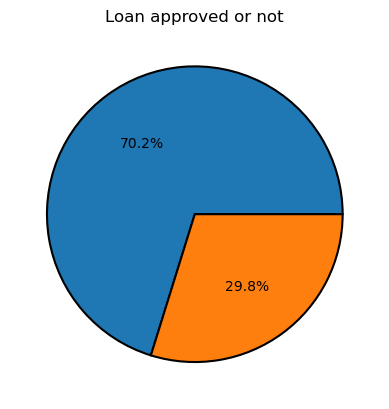
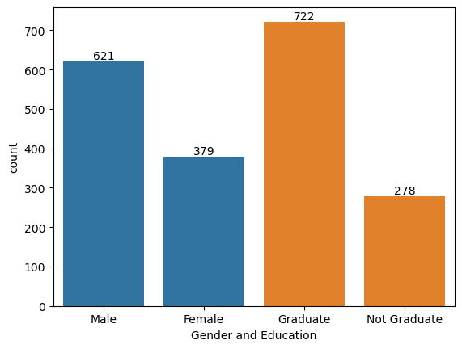
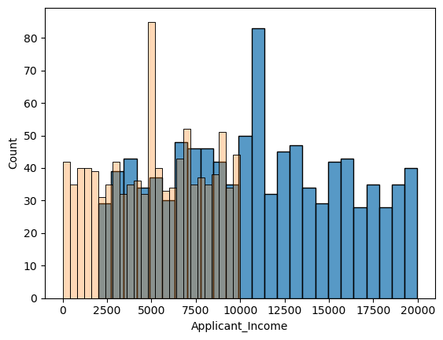
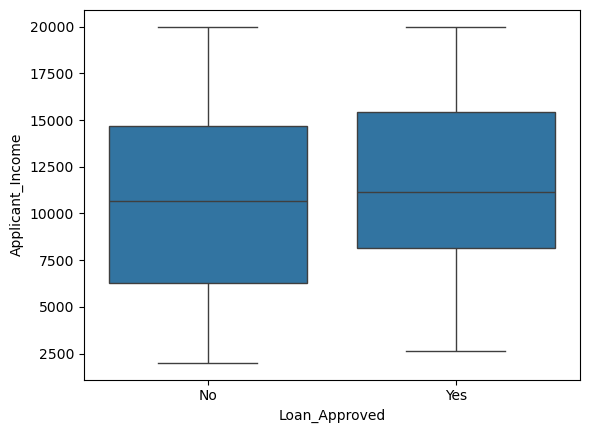
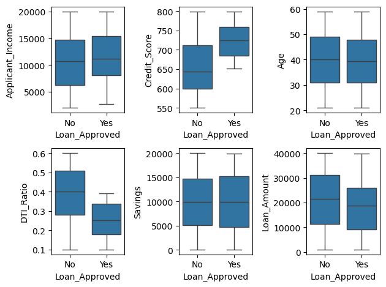
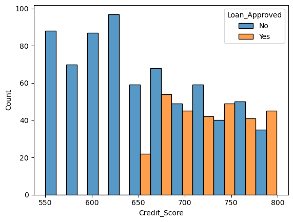
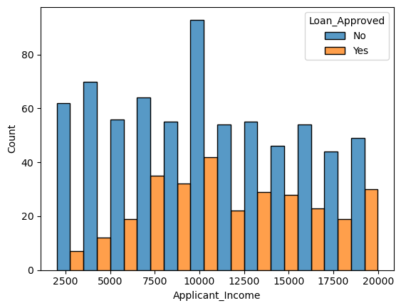
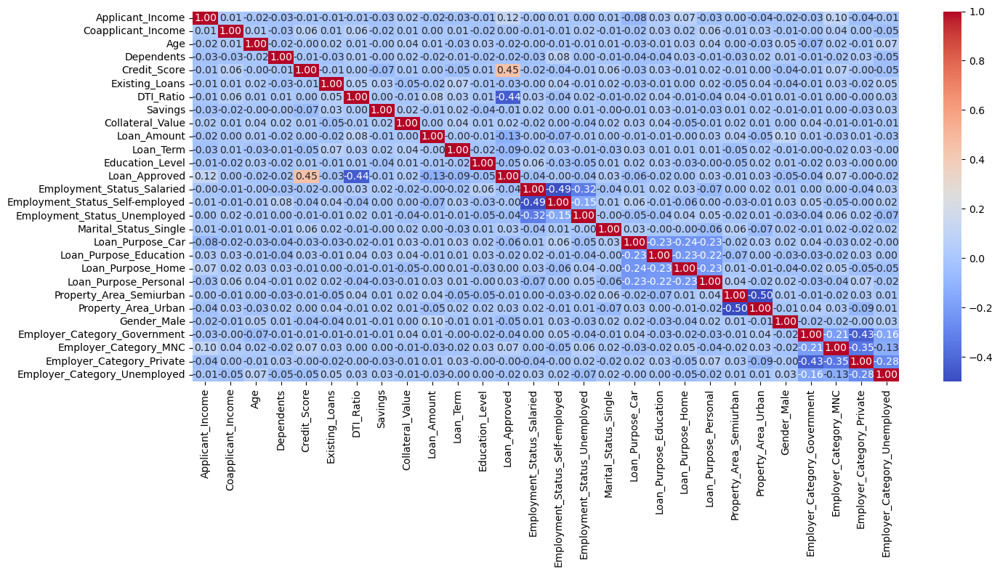

```python
import pandas as pd 
import numpy as np
import matplotlib.pyplot as plt
import seaborn as sns 
from sklearn.model_selection import train_test_split 
```


```python
df = pd.read_csv("loan_approval_data.csv")

df.isnull().sum() # all column have 50 null values
df.head()
df.describe()
```


<table border="1" class="dataframe">
  <thead>
    <tr style="text-align: right;">
      <th></th>
      <th>Applicant_ID</th>
      <th>Applicant_Income</th>
      <th>Coapplicant_Income</th>
      <th>Age</th>
      <th>Dependents</th>
      <th>Credit_Score</th>
      <th>Existing_Loans</th>
      <th>DTI_Ratio</th>
      <th>Savings</th>
      <th>Collateral_Value</th>
      <th>Loan_Amount</th>
      <th>Loan_Term</th>
    </tr>
  </thead>
  <tbody>
    <tr>
      <th>count</th>
      <td>950.000000</td>
      <td>950.000000</td>
      <td>950.000000</td>
      <td>950.000000</td>
      <td>950.000000</td>
      <td>950.000000</td>
      <td>950.000000</td>
      <td>950.000000</td>
      <td>950.000000</td>
      <td>950.000000</td>
      <td>950.000000</td>
      <td>950.000000</td>
    </tr>
    <tr>
      <th>mean</th>
      <td>501.220000</td>
      <td>10852.571579</td>
      <td>5082.455789</td>
      <td>39.971579</td>
      <td>1.474737</td>
      <td>676.033684</td>
      <td>1.950526</td>
      <td>0.347263</td>
      <td>9940.452632</td>
      <td>24802.792632</td>
      <td>20522.825263</td>
      <td>48.000000</td>
    </tr>
    <tr>
      <th>std</th>
      <td>289.608451</td>
      <td>5061.632859</td>
      <td>2943.161570</td>
      <td>11.139797</td>
      <td>1.105067</td>
      <td>71.346015</td>
      <td>1.406246</td>
      <td>0.144341</td>
      <td>5860.736885</td>
      <td>14345.696031</td>
      <td>11504.142575</td>
      <td>24.245322</td>
    </tr>
    <tr>
      <th>min</th>
      <td>1.000000</td>
      <td>2009.000000</td>
      <td>1.000000</td>
      <td>21.000000</td>
      <td>0.000000</td>
      <td>550.000000</td>
      <td>0.000000</td>
      <td>0.100000</td>
      <td>65.000000</td>
      <td>36.000000</td>
      <td>1015.000000</td>
      <td>12.000000</td>
    </tr>
    <tr>
      <th>25%</th>
      <td>250.250000</td>
      <td>6730.750000</td>
      <td>2472.750000</td>
      <td>30.250000</td>
      <td>1.000000</td>
      <td>616.250000</td>
      <td>1.000000</td>
      <td>0.220000</td>
      <td>4760.250000</td>
      <td>12698.250000</td>
      <td>9806.250000</td>
      <td>24.000000</td>
    </tr>
    <tr>
      <th>50%</th>
      <td>499.500000</td>
      <td>10548.000000</td>
      <td>5205.500000</td>
      <td>40.000000</td>
      <td>1.000000</td>
      <td>678.000000</td>
      <td>2.000000</td>
      <td>0.340000</td>
      <td>9880.500000</td>
      <td>24321.000000</td>
      <td>21210.500000</td>
      <td>48.000000</td>
    </tr>
    <tr>
      <th>75%</th>
      <td>752.750000</td>
      <td>15190.000000</td>
      <td>7620.750000</td>
      <td>49.000000</td>
      <td>2.000000</td>
      <td>737.000000</td>
      <td>3.000000</td>
      <td>0.480000</td>
      <td>15074.500000</td>
      <td>36947.000000</td>
      <td>30263.000000</td>
      <td>72.000000</td>
    </tr>
    <tr>
      <th>max</th>
      <td>1000.000000</td>
      <td>19988.000000</td>
      <td>9996.000000</td>
      <td>59.000000</td>
      <td>3.000000</td>
      <td>799.000000</td>
      <td>4.000000</td>
      <td>0.600000</td>
      <td>19996.000000</td>
      <td>49954.000000</td>
      <td>39995.000000</td>
      <td>84.000000</td>
    </tr>
  </tbody>
</table>
</div>


## Data Cleaning - Handling missing values 
##### for numeric values we fill mean value in place of null values
##### for categorical values we fill mode(most repeated) values in place of null values


```python
categorical_cols = df.select_dtypes(include = ["object"]).columns
numerical_cols = df.select_dtypes(include = ["number"]).columns
```


```python
numerical_cols
```


    Index(['Applicant_ID', 'Applicant_Income', 'Coapplicant_Income', 'Age',
           'Dependents', 'Credit_Score', 'Existing_Loans', 'DTI_Ratio', 'Savings',
           'Collateral_Value', 'Loan_Amount', 'Loan_Term'],
          dtype='object')


```python
from sklearn.impute import SimpleImputer

# Filling numerical cols 

num_imp = SimpleImputer(strategy = "mean")
df[numerical_cols] = num_imp.fit_transform(df[numerical_cols])


```


```python
# Filling categorical cols

cat_imp = SimpleImputer(strategy = "most_frequent")
df[categorical_cols] = cat_imp.fit_transform(df[categorical_cols])
```


```python
df.info()
```

    <class 'pandas.core.frame.DataFrame'>
    RangeIndex: 1000 entries, 0 to 999
    Data columns (total 20 columns):
     #   Column              Non-Null Count  Dtype  
    ---  ------              --------------  -----  
     0   Applicant_ID        1000 non-null   float64
     1   Applicant_Income    1000 non-null   float64
     2   Coapplicant_Income  1000 non-null   float64
     3   Employment_Status   1000 non-null   object 
     4   Age                 1000 non-null   float64
     5   Marital_Status      1000 non-null   object 
     6   Dependents          1000 non-null   float64
     7   Credit_Score        1000 non-null   float64
     8   Existing_Loans      1000 non-null   float64
     9   DTI_Ratio           1000 non-null   float64
     10  Savings             1000 non-null   float64
     11  Collateral_Value    1000 non-null   float64
     12  Loan_Amount         1000 non-null   float64
     13  Loan_Term           1000 non-null   float64
     14  Loan_Purpose        1000 non-null   object 
     15  Property_Area       1000 non-null   object 
     16  Education_Level     1000 non-null   object 
     17  Gender              1000 non-null   object 
     18  Employer_Category   1000 non-null   object 
     19  Loan_Approved       1000 non-null   object 
    dtypes: float64(12), object(8)
    memory usage: 156.4+ KB
    

## EDA


```python
# how balanced our classes are 

classes_count = df["Loan_Approved"].value_counts()
print(classes_count)

plt.pie(classes_count,autopct = "%1.1f%%",wedgeprops = {
            "edgecolor": "black",
            "linewidth": 1.5})
plt.title("Loan approved or not")
```

    Loan_Approved
    No     702
    Yes    298
    Name: count, dtype: int64
    
    Text(0.5, 1.0, 'Loan approved or not')


    

    


```python
# Gender split in data 

gender_count = df["Gender"].value_counts()
print(gender_count)
ax = sns.barplot(gender_count)
ax.bar_label(ax.containers[0])

# Education level

edu_count = df["Education_Level"].value_counts()
print(edu_count)
ax = sns.barplot(edu_count)
ax.bar_label(ax.containers[1])

plt.xlabel("Gender and Education")
```

    Gender
    Male      621
    Female    379
    Name: count, dtype: int64
    Education_Level
    Graduate        722
    Not Graduate    278
    Name: count, dtype: int64
    
    Text(0.5, 0, 'Gender and Education')


    

    


```python
# Analyze loan approval with income 

sns.histplot(
    data = df,
    x = "Applicant_Income",
    bins = 25
)
sns.histplot(
    data = df,
    x = "Coapplicant_Income",
    bins = 25,
    alpha = 0.3
)
```


    <Axes: xlabel='Applicant_Income', ylabel='Count'>


    

    


```python
# To detect outlier we use box plots 

sns.boxplot(
    data = df,
    x = "Loan_Approved",
    y = "Applicant_Income"
)
```


    <Axes: xlabel='Loan_Approved', ylabel='Applicant_Income'>


    

    


```python
# Loan approval with different features 

fig,axes = plt.subplots(2,3)

sns.boxplot(ax = axes[0,0],data = df,x = "Loan_Approved",y = "Applicant_Income")
sns.boxplot(ax = axes[0,1],data = df,x = "Loan_Approved",y = "Credit_Score")
sns.boxplot(ax = axes[0,2],data = df,x = "Loan_Approved",y = "Age")
sns.boxplot(ax = axes[1,0],data = df,x = "Loan_Approved",y = "DTI_Ratio")
sns.boxplot(ax = axes[1,1],data = df,x = "Loan_Approved",y = "Savings")
sns.boxplot(ax = axes[1,2],data = df,x = "Loan_Approved",y = "Loan_Amount")
plt.tight_layout()
```


    

    


```python
# Credit Score with Loan approved

sns.histplot(
    data = df,
    x = "Credit_Score",
    hue = "Loan_Approved",
    multiple = "dodge"
)
```


    <Axes: xlabel='Credit_Score', ylabel='Count'>


    

    


```python
# Applicant  with Loan approved

sns.histplot(
    data = df,
    x = "Applicant_Income",
    hue = "Loan_Approved",
    multiple = "dodge"
)
```


    <Axes: xlabel='Applicant_Income', ylabel='Count'>


    

    


```python
# removing applicant id bcz it doesn't affect the loan approval probability

df = df.drop("Applicant_ID", axis = 1)

df.head()
```


<div>
<table border="1" class="dataframe">
  <thead>
    <tr style="text-align: right;">
      <th></th>
      <th>Applicant_Income</th>
      <th>Coapplicant_Income</th>
      <th>Employment_Status</th>
      <th>Age</th>
      <th>Marital_Status</th>
      <th>Dependents</th>
      <th>Credit_Score</th>
      <th>Existing_Loans</th>
      <th>DTI_Ratio</th>
      <th>Savings</th>
      <th>Collateral_Value</th>
      <th>Loan_Amount</th>
      <th>Loan_Term</th>
      <th>Loan_Purpose</th>
      <th>Property_Area</th>
      <th>Education_Level</th>
      <th>Gender</th>
      <th>Employer_Category</th>
      <th>Loan_Approved</th>
    </tr>
  </thead>
  <tbody>
    <tr>
      <th>0</th>
      <td>17795.0</td>
      <td>1387.0</td>
      <td>Salaried</td>
      <td>51.0</td>
      <td>Married</td>
      <td>0.0</td>
      <td>637.0</td>
      <td>4.0</td>
      <td>0.53</td>
      <td>19403.0</td>
      <td>45638.0</td>
      <td>16619.0</td>
      <td>84.0</td>
      <td>Personal</td>
      <td>Urban</td>
      <td>Not Graduate</td>
      <td>Female</td>
      <td>Private</td>
      <td>No</td>
    </tr>
    <tr>
      <th>1</th>
      <td>2860.0</td>
      <td>2679.0</td>
      <td>Salaried</td>
      <td>46.0</td>
      <td>Married</td>
      <td>3.0</td>
      <td>621.0</td>
      <td>2.0</td>
      <td>0.30</td>
      <td>2580.0</td>
      <td>49272.0</td>
      <td>38687.0</td>
      <td>48.0</td>
      <td>Car</td>
      <td>Semiurban</td>
      <td>Graduate</td>
      <td>Male</td>
      <td>Private</td>
      <td>No</td>
    </tr>
    <tr>
      <th>2</th>
      <td>7390.0</td>
      <td>2106.0</td>
      <td>Salaried</td>
      <td>25.0</td>
      <td>Single</td>
      <td>2.0</td>
      <td>674.0</td>
      <td>4.0</td>
      <td>0.20</td>
      <td>13844.0</td>
      <td>6908.0</td>
      <td>27943.0</td>
      <td>72.0</td>
      <td>Business</td>
      <td>Urban</td>
      <td>Graduate</td>
      <td>Female</td>
      <td>Government</td>
      <td>Yes</td>
    </tr>
    <tr>
      <th>3</th>
      <td>13964.0</td>
      <td>8173.0</td>
      <td>Salaried</td>
      <td>40.0</td>
      <td>Married</td>
      <td>2.0</td>
      <td>579.0</td>
      <td>3.0</td>
      <td>0.31</td>
      <td>9553.0</td>
      <td>10844.0</td>
      <td>27819.0</td>
      <td>60.0</td>
      <td>Business</td>
      <td>Rural</td>
      <td>Graduate</td>
      <td>Female</td>
      <td>Government</td>
      <td>No</td>
    </tr>
    <tr>
      <th>4</th>
      <td>13284.0</td>
      <td>4223.0</td>
      <td>Self-employed</td>
      <td>31.0</td>
      <td>Single</td>
      <td>2.0</td>
      <td>721.0</td>
      <td>1.0</td>
      <td>0.29</td>
      <td>9386.0</td>
      <td>37629.0</td>
      <td>12741.0</td>
      <td>72.0</td>
      <td>Car</td>
      <td>Urban</td>
      <td>Graduate</td>
      <td>Male</td>
      <td>Private</td>
      <td>Yes</td>
    </tr>
  </tbody>
</table>
</div>


## Encoding 


```python
# LabelEncoder = assigns an integer to each category (same as map function)

# OneHotEncoder = creates binary columns for each category (same as get_dummy function)
```


```python
df.info()
```

    <class 'pandas.core.frame.DataFrame'>
    RangeIndex: 1000 entries, 0 to 999
    Data columns (total 19 columns):
     #   Column              Non-Null Count  Dtype  
    ---  ------              --------------  -----  
     0   Applicant_Income    1000 non-null   float64
     1   Coapplicant_Income  1000 non-null   float64
     2   Employment_Status   1000 non-null   object 
     3   Age                 1000 non-null   float64
     4   Marital_Status      1000 non-null   object 
     5   Dependents          1000 non-null   float64
     6   Credit_Score        1000 non-null   float64
     7   Existing_Loans      1000 non-null   float64
     8   DTI_Ratio           1000 non-null   float64
     9   Savings             1000 non-null   float64
     10  Collateral_Value    1000 non-null   float64
     11  Loan_Amount         1000 non-null   float64
     12  Loan_Term           1000 non-null   float64
     13  Loan_Purpose        1000 non-null   object 
     14  Property_Area       1000 non-null   object 
     15  Education_Level     1000 non-null   object 
     16  Gender              1000 non-null   object 
     17  Employer_Category   1000 non-null   object 
     18  Loan_Approved       1000 non-null   object 
    dtypes: float64(11), object(8)
    memory usage: 148.6+ KB
    


```python
from sklearn.preprocessing import LabelEncoder, OneHotEncoder

# LabelEncoder
le = LabelEncoder()
df["Education_Level"] = le.fit_transform(df["Education_Level"])
df["Loan_Approved"] = le.fit_transform(df["Loan_Approved"])
```


```python
df.head()
```


<div>

<table border="1" class="dataframe">
  <thead>
    <tr style="text-align: right;">
      <th></th>
      <th>Applicant_Income</th>
      <th>Coapplicant_Income</th>
      <th>Employment_Status</th>
      <th>Age</th>
      <th>Marital_Status</th>
      <th>Dependents</th>
      <th>Credit_Score</th>
      <th>Existing_Loans</th>
      <th>DTI_Ratio</th>
      <th>Savings</th>
      <th>Collateral_Value</th>
      <th>Loan_Amount</th>
      <th>Loan_Term</th>
      <th>Loan_Purpose</th>
      <th>Property_Area</th>
      <th>Education_Level</th>
      <th>Gender</th>
      <th>Employer_Category</th>
      <th>Loan_Approved</th>
    </tr>
  </thead>
  <tbody>
    <tr>
      <th>0</th>
      <td>17795.0</td>
      <td>1387.0</td>
      <td>Salaried</td>
      <td>51.0</td>
      <td>Married</td>
      <td>0.0</td>
      <td>637.0</td>
      <td>4.0</td>
      <td>0.53</td>
      <td>19403.0</td>
      <td>45638.0</td>
      <td>16619.0</td>
      <td>84.0</td>
      <td>Personal</td>
      <td>Urban</td>
      <td>1</td>
      <td>Female</td>
      <td>Private</td>
      <td>0</td>
    </tr>
    <tr>
      <th>1</th>
      <td>2860.0</td>
      <td>2679.0</td>
      <td>Salaried</td>
      <td>46.0</td>
      <td>Married</td>
      <td>3.0</td>
      <td>621.0</td>
      <td>2.0</td>
      <td>0.30</td>
      <td>2580.0</td>
      <td>49272.0</td>
      <td>38687.0</td>
      <td>48.0</td>
      <td>Car</td>
      <td>Semiurban</td>
      <td>0</td>
      <td>Male</td>
      <td>Private</td>
      <td>0</td>
    </tr>
    <tr>
      <th>2</th>
      <td>7390.0</td>
      <td>2106.0</td>
      <td>Salaried</td>
      <td>25.0</td>
      <td>Single</td>
      <td>2.0</td>
      <td>674.0</td>
      <td>4.0</td>
      <td>0.20</td>
      <td>13844.0</td>
      <td>6908.0</td>
      <td>27943.0</td>
      <td>72.0</td>
      <td>Business</td>
      <td>Urban</td>
      <td>0</td>
      <td>Female</td>
      <td>Government</td>
      <td>1</td>
    </tr>
    <tr>
      <th>3</th>
      <td>13964.0</td>
      <td>8173.0</td>
      <td>Salaried</td>
      <td>40.0</td>
      <td>Married</td>
      <td>2.0</td>
      <td>579.0</td>
      <td>3.0</td>
      <td>0.31</td>
      <td>9553.0</td>
      <td>10844.0</td>
      <td>27819.0</td>
      <td>60.0</td>
      <td>Business</td>
      <td>Rural</td>
      <td>0</td>
      <td>Female</td>
      <td>Government</td>
      <td>0</td>
    </tr>
    <tr>
      <th>4</th>
      <td>13284.0</td>
      <td>4223.0</td>
      <td>Self-employed</td>
      <td>31.0</td>
      <td>Single</td>
      <td>2.0</td>
      <td>721.0</td>
      <td>1.0</td>
      <td>0.29</td>
      <td>9386.0</td>
      <td>37629.0</td>
      <td>12741.0</td>
      <td>72.0</td>
      <td>Car</td>
      <td>Urban</td>
      <td>0</td>
      <td>Male</td>
      <td>Private</td>
      <td>1</td>
    </tr>
  </tbody>
</table>
</div>


```python
# OneHotEncoder
cols = ["Employment_Status","Marital_Status","Loan_Purpose","Property_Area","Gender","Employer_Category"]

ohe = OneHotEncoder(
    drop = "first",
    sparse_output = False,
    handle_unknown = "ignore"
)

encoded = ohe.fit_transform(df[cols])
# now here it returns the encoded value only not put in data so we have to do it.

encoded # encoded values 
ohe.get_feature_names_out(cols)

encoded_df = pd.DataFrame(encoded, columns = ohe.get_feature_names_out(cols), index = df.index)
```


```python
encoded_df.head() # Now this is the new dataframe we got 
```


<div>

<table border="1" class="dataframe">
  <thead>
    <tr style="text-align: right;">
      <th></th>
      <th>Employment_Status_Salaried</th>
      <th>Employment_Status_Self-employed</th>
      <th>Employment_Status_Unemployed</th>
      <th>Marital_Status_Single</th>
      <th>Loan_Purpose_Car</th>
      <th>Loan_Purpose_Education</th>
      <th>Loan_Purpose_Home</th>
      <th>Loan_Purpose_Personal</th>
      <th>Property_Area_Semiurban</th>
      <th>Property_Area_Urban</th>
      <th>Gender_Male</th>
      <th>Employer_Category_Government</th>
      <th>Employer_Category_MNC</th>
      <th>Employer_Category_Private</th>
      <th>Employer_Category_Unemployed</th>
    </tr>
  </thead>
  <tbody>
    <tr>
      <th>0</th>
      <td>1.0</td>
      <td>0.0</td>
      <td>0.0</td>
      <td>0.0</td>
      <td>0.0</td>
      <td>0.0</td>
      <td>0.0</td>
      <td>1.0</td>
      <td>0.0</td>
      <td>1.0</td>
      <td>0.0</td>
      <td>0.0</td>
      <td>0.0</td>
      <td>1.0</td>
      <td>0.0</td>
    </tr>
    <tr>
      <th>1</th>
      <td>1.0</td>
      <td>0.0</td>
      <td>0.0</td>
      <td>0.0</td>
      <td>1.0</td>
      <td>0.0</td>
      <td>0.0</td>
      <td>0.0</td>
      <td>1.0</td>
      <td>0.0</td>
      <td>1.0</td>
      <td>0.0</td>
      <td>0.0</td>
      <td>1.0</td>
      <td>0.0</td>
    </tr>
    <tr>
      <th>2</th>
      <td>1.0</td>
      <td>0.0</td>
      <td>0.0</td>
      <td>1.0</td>
      <td>0.0</td>
      <td>0.0</td>
      <td>0.0</td>
      <td>0.0</td>
      <td>0.0</td>
      <td>1.0</td>
      <td>0.0</td>
      <td>1.0</td>
      <td>0.0</td>
      <td>0.0</td>
      <td>0.0</td>
    </tr>
    <tr>
      <th>3</th>
      <td>1.0</td>
      <td>0.0</td>
      <td>0.0</td>
      <td>0.0</td>
      <td>0.0</td>
      <td>0.0</td>
      <td>0.0</td>
      <td>0.0</td>
      <td>0.0</td>
      <td>0.0</td>
      <td>0.0</td>
      <td>1.0</td>
      <td>0.0</td>
      <td>0.0</td>
      <td>0.0</td>
    </tr>
    <tr>
      <th>4</th>
      <td>0.0</td>
      <td>1.0</td>
      <td>0.0</td>
      <td>1.0</td>
      <td>1.0</td>
      <td>0.0</td>
      <td>0.0</td>
      <td>0.0</td>
      <td>0.0</td>
      <td>1.0</td>
      <td>1.0</td>
      <td>0.0</td>
      <td>0.0</td>
      <td>1.0</td>
      <td>0.0</td>
    </tr>
  </tbody>
</table>
</div>


```python
# To put these values in the original df we will concatenate both df and encoded_df

df = pd.concat([df.drop(columns = cols),encoded_df],axis = 1)
```


```python
df.head()
df.info()
# all of the columns are now in number thus the model can understand the data better.
```

    <class 'pandas.core.frame.DataFrame'>
    RangeIndex: 1000 entries, 0 to 999
    Data columns (total 28 columns):
     #   Column                           Non-Null Count  Dtype  
    ---  ------                           --------------  -----  
     0   Applicant_Income                 1000 non-null   float64
     1   Coapplicant_Income               1000 non-null   float64
     2   Age                              1000 non-null   float64
     3   Dependents                       1000 non-null   float64
     4   Credit_Score                     1000 non-null   float64
     5   Existing_Loans                   1000 non-null   float64
     6   DTI_Ratio                        1000 non-null   float64
     7   Savings                          1000 non-null   float64
     8   Collateral_Value                 1000 non-null   float64
     9   Loan_Amount                      1000 non-null   float64
     10  Loan_Term                        1000 non-null   float64
     11  Education_Level                  1000 non-null   int64  
     12  Loan_Approved                    1000 non-null   int64  
     13  Employment_Status_Salaried       1000 non-null   float64
     14  Employment_Status_Self-employed  1000 non-null   float64
     15  Employment_Status_Unemployed     1000 non-null   float64
     16  Marital_Status_Single            1000 non-null   float64
     17  Loan_Purpose_Car                 1000 non-null   float64
     18  Loan_Purpose_Education           1000 non-null   float64
     19  Loan_Purpose_Home                1000 non-null   float64
     20  Loan_Purpose_Personal            1000 non-null   float64
     21  Property_Area_Semiurban          1000 non-null   float64
     22  Property_Area_Urban              1000 non-null   float64
     23  Gender_Male                      1000 non-null   float64
     24  Employer_Category_Government     1000 non-null   float64
     25  Employer_Category_MNC            1000 non-null   float64
     26  Employer_Category_Private        1000 non-null   float64
     27  Employer_Category_Unemployed     1000 non-null   float64
    dtypes: float64(26), int64(2)
    memory usage: 218.9 KB
    

## Correlation Heatmap


```python
num_cols = df.select_dtypes(include = "number")
corr_m = num_cols.corr()
```


```python
corr_matrix = num_cols.corr()["Loan_Approved"].sort_values(ascending = False)
# tells the relation of every feature with Loan_approved(output)
```


```python
plt.figure(figsize = (15,8))
sns.heatmap(
    corr_m,
    annot = True,
    fmt = ".2f",
    cmap = "coolwarm"
)

plt.tight_layout()
```


    

    


# Model training 

## Train-Test-Split + Feature Scaling


```python
X = df.drop("Loan_Approved",axis = 1)
y = df["Loan_Approved"]
```


```python
X_train,X_test,y_train,y_test = train_test_split(
    X, y, test_size = 0.2,random_state = 42
)
```


```python
from sklearn.preprocessing import StandardScaler
scaler = StandardScaler()
X_train_scaled = scaler.fit_transform(X_train)
X_test_scaled = scaler.transform(X_test)
```

## Prediction 


```python
# Logistic Regression 

from sklearn.linear_model import LogisticRegression

log_model = LogisticRegression()
log_model.fit(X_train_scaled,y_train)

y_pred = log_model.predict(X_test_scaled)

# Evaluation 
# here for loan based model we need precison_score as the evaluation matrics. 
# as we try to reduce type1 error in which FP occur
from sklearn.metrics import accuracy_score,recall_score,precision_score,confusion_matrix, f1_score

print("Precision :", precision_score(y_test,y_pred)) # most imp here 
print("Recall :", recall_score(y_test,y_pred))
print("Accuracy :", accuracy_score(y_test,y_pred))
print("F1 score :", f1_score(y_test,y_pred))
print("Confusion Matrix :\n" , confusion_matrix(y_test,y_pred))
```

    Precision : 0.7833333333333333
    Recall : 0.7704918032786885
    Accuracy : 0.865
    F1 score : 0.7768595041322314
    Confusion Matrix :
     [[126  13]
     [ 14  47]]
    


```python
# kNN 

from sklearn.neighbors import KNeighborsClassifier

knn_model = KNeighborsClassifier(n_neighbors = 13)
knn_model.fit(X_train_scaled,y_train)

y_pred = knn_model.predict(X_test_scaled)

# Evaluation 
# here for loan based model we need precison_score as the evaluation matrics. 
# as we try to reduce type1 error in which FP occur
from sklearn.metrics import accuracy_score,recall_score,precision_score,confusion_matrix, f1_score

print("Precision :", precision_score(y_test,y_pred)) # most imp here 
print("Recall :", recall_score(y_test,y_pred))
print("Accuracy :", accuracy_score(y_test,y_pred))
print("F1 score :", f1_score(y_test,y_pred))
print("Confusion Matrix :\n" , confusion_matrix(y_test,y_pred))


# Now this model won't perofrm well on this data bcz it has high no. of features 
# and kNN dosn't perform well for such datasets 
```

    Precision : 0.7317073170731707
    Recall : 0.4918032786885246
    Accuracy : 0.79
    F1 score : 0.5882352941176471
    Confusion Matrix :
     [[128  11]
     [ 31  30]]
    


```python
# Naive Bayes

from sklearn.naive_bayes import GaussianNB

nb_model = GaussianNB()
nb_model.fit(X_train_scaled,y_train)

y_pred = nb_model.predict(X_test_scaled)

# Evaluation 
# here for loan based model we need precison_score as the evaluation matrics. 
# as we try to reduce type1 error in which FP occur
from sklearn.metrics import accuracy_score,recall_score,precision_score,confusion_matrix, f1_score

print("Precision :", precision_score(y_test,y_pred)) # most imp here 
print("Recall :", recall_score(y_test,y_pred))
print("Accuracy :", accuracy_score(y_test,y_pred))
print("F1 score :", f1_score(y_test,y_pred))
print("Confusion Matrix :\n" , confusion_matrix(y_test,y_pred))
```

    Precision : 0.8035714285714286
    Recall : 0.7377049180327869
    Accuracy : 0.865
    F1 score : 0.7692307692307693
    Confusion Matrix :
     [[128  11]
     [ 16  45]]
    

### Best model on the basis of precision => Naive Bayes

# Feature Engineering 


```python
# Adding New Features

df["DTI_Ratio_sq"] = df["DTI_Ratio"] ** 2
df["Credit_Score_sq"] = df["Credit_Score"] ** 2

# Compressing Skewed Data 

# df["Applicant_Income_log"] = np.log1p(df["Applicant_Income"])

X = df.drop(columns = ["Loan_Approved","Credit_Score","DTI_Ratio"])
y = df["Loan_Approved"]

# Train_test_split 

X_train,X_test,y_train,y_test = train_test_split(
    X, y, test_size = 0.2, random_state = 42
)

# Scaling 

scaler = StandardScaler()
X_train_scaled = scaler.fit_transform(X_train)
X_test_scaled = scaler.transform(X_test)

# Logistic Regression

log_model = LogisticRegression()
log_model.fit(X_train_scaled,y_train)

y_pred1 = log_model.predict(X_test_scaled)
print("Logistice regression")
print("Precision :", precision_score(y_test,y_pred1)) # most imp here 
print("Recall :", recall_score(y_test,y_pred1))
print("Accuracy :", accuracy_score(y_test,y_pred1))
print("F1 score :", f1_score(y_test,y_pred1))
print("Confusion Matrix :\n" , confusion_matrix(y_test,y_pred1))
print("\n")

# kNN

knn_model = KNeighborsClassifier(n_neighbors = 13)
knn_model.fit(X_train_scaled,y_train)

y_pred = knn_model.predict(X_test_scaled)
print("kNN Model")
print("Precision :", precision_score(y_test,y_pred)) # most imp here 
print("Recall :", recall_score(y_test,y_pred))
print("Accuracy :", accuracy_score(y_test,y_pred))
print("F1 score :", f1_score(y_test,y_pred))
print("Confusion Matrix :\n" , confusion_matrix(y_test,y_pred))
print("\n")

# Naive Bayes

nb_model = GaussianNB()
nb_model.fit(X_train_scaled,y_train)

y_pred = nb_model.predict(X_test_scaled)
print("Naive bayes")
print("Precision :", precision_score(y_test,y_pred)) # most imp here 
print("Recall :", recall_score(y_test,y_pred))
print("Accuracy :", accuracy_score(y_test,y_pred))
print("F1 score :", f1_score(y_test,y_pred))
print("Confusion Matrix :\n" , confusion_matrix(y_test,y_pred))
```

    Logistice regression
    Precision : 0.7903225806451613
    Recall : 0.8032786885245902
    Accuracy : 0.875
    F1 score : 0.7967479674796748
    Confusion Matrix :
     [[126  13]
     [ 12  49]]
    
    
    kNN Model
    Precision : 0.7368421052631579
    Recall : 0.45901639344262296
    Accuracy : 0.785
    F1 score : 0.5656565656565656
    Confusion Matrix :
     [[129  10]
     [ 33  28]]
    
    
    Naive bayes
    Precision : 0.7833333333333333
    Recall : 0.7704918032786885
    Accuracy : 0.865
    F1 score : 0.7768595041322314
    Confusion Matrix :
     [[126  13]
     [ 14  47]]
    
